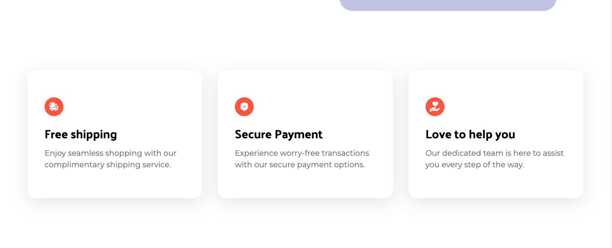

# Nike
This project was made with the aim of practicing Tailwind CSS.

<div align="center" display="inline">





</div>

## Run locally:
- First clone the repository into your machine;

```
git clone git@github.com:GabiNamu/Tryunfo.git
```

- Go to the project directory:
```
cd nike
```
 
- Install dependencies;

```
npm install
```
- Start the server;
```
npm run dev
```

## Main technologies used:
- React;
- JavaScript;
- Tailwind CSS;
- Vite;
